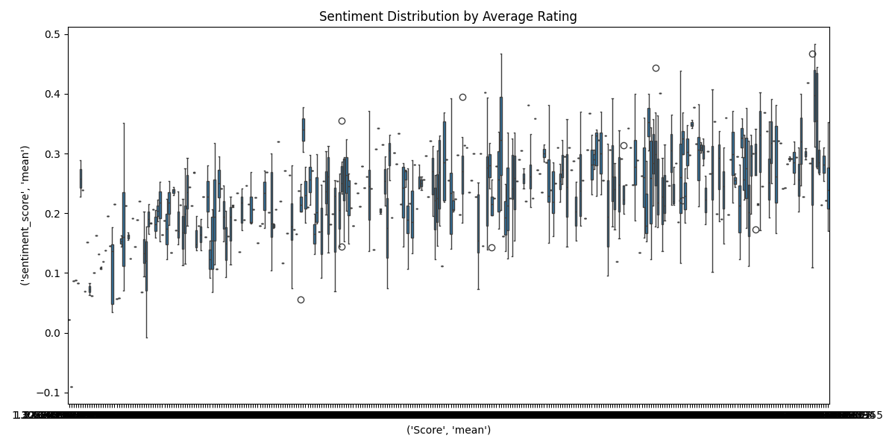
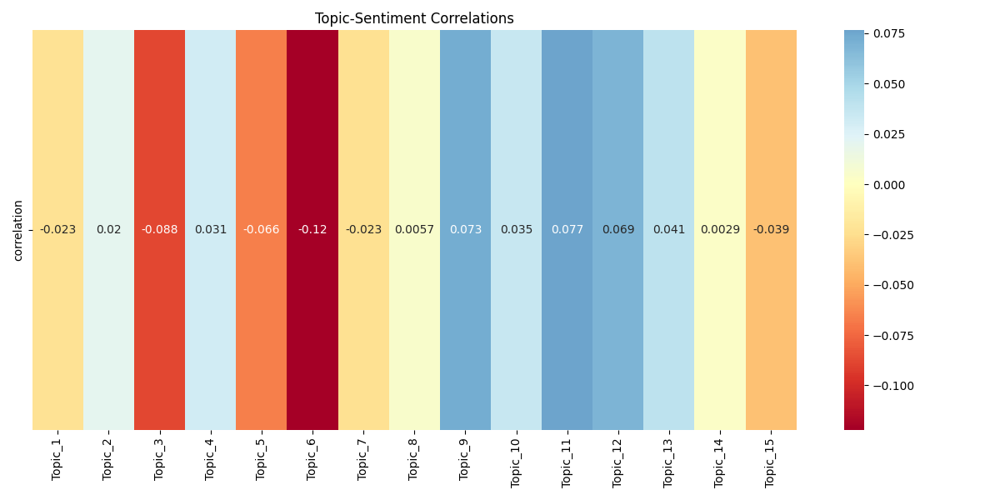
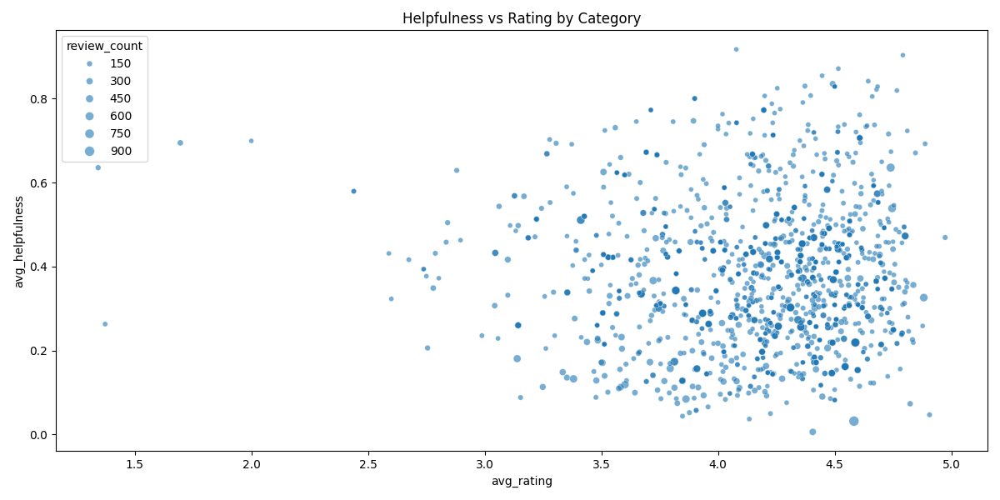

# 🛒 Amazon Product Review Analysis Dashboard

Welcome to the **Amazon Product Review Analysis Dashboard**! This project analyzes over 568K Amazon reviews, uncovering insights through advanced techniques like **LDA Topic Modeling**, **Sentiment Analysis**, and **Helpfulness Prediction**. Built with Streamlit, this dashboard offers an interactive way to explore customer sentiments and review patterns. 🚀

---

## ✨ Key Insights

- 🧠 **Topic Modeling**: Identified 15 key topics, with coherence peaking at 10 topics for meaningful themes.
- 📈 **Sentiment Trends**: Positive sentiment surged between 2000 and 2012, reflecting growing customer satisfaction.
- ⭐ **Helpfulness Factors**: Text length and word count are the top predictors of a review’s helpfulness.

---

## 📊 Output Visualizations

### 🔍 Topic Modeling
Uncover the main themes in Amazon reviews using LDA.

- **Topic Coherence**: Coherence peaks at 10 topics, ensuring meaningful themes.  
  
  
- **Word Cloud**: Visualizes the most frequent terms, with larger words indicating higher frequency.  
  

### 😊 Sentiment Analysis
Analyze customer sentiment over time and across categories.

- **Sentiment Trends**: Tracks polarity over time, showing a rise in positivity from 2000 to 2012.  
  
  
- **Sentiment Distribution**: Displays the spread of sentiment scores across ratings.  
  
  
- **Sentiment Heatmap**: Highlights sentiment variations across categories over time.  
  

### 🔗 Impact Analysis
Understand how topics influence sentiment.

- **Topic-Sentiment Correlations**: Reveals how topics correlate with sentiment scores.  
  

### 💡 Helpfulness Analysis
Explore what makes a review helpful.

- **Feature Importance**: Identifies text length and word count as key predictors of helpfulness.  
  
  
- **Category Patterns**: Shows helpfulness variations across product categories.  
  

---

## 🚀 Live Dashboard Setup

To run the interactive dashboard locally, ensure you have the required dependencies (`streamlit`, `pandas`, `PIL`), then execute:

```bash
streamlit run dashboard/app.py