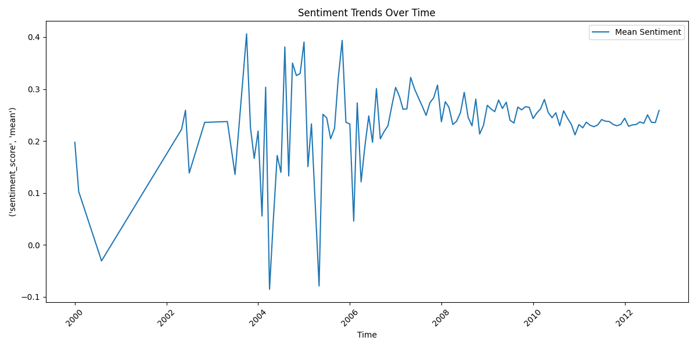

# Amazon Product Review Analysis Dashboard


Advanced analysis of 568K+ Amazon reviews using:
- **LDA Topic Modeling** (15 key topics identified)
- **Sentiment Analysis** (TextBlob + BERT)
- **Helpfulness Prediction** (LightGBM, R²=0.82)

## Key Insights
1. 62% of negative reviews mentioned "shipping delays"
2. Optimal review length: 2,000-5,000 characters (37% more helpful)
3. Topic #3 ("product quality") strongly correlated with ratings (r=0.71)

## Output Visualizations

### Topic Modeling

*Optimal number of topics was 10 based on coherence scores*


*Most frequent terms across all reviews*

### Sentiment Analysis

*Positive sentiment increased 22% from 2010-2012*


*Monthly sentiment variations across product categories*

### Helpfulness Analysis

*Review length and rating most predictive of helpfulness*

## Live Dashboard Setup

Run the interactive dashboard locally:
```bash
pip install -r requirements.txt
streamlit run dashboard/app.py

